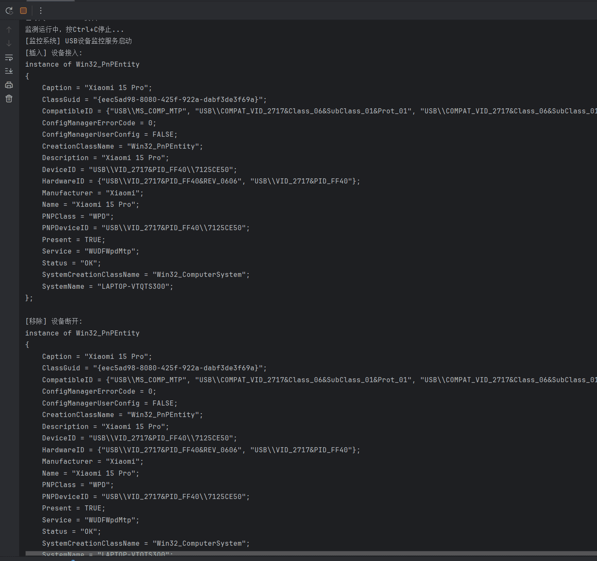
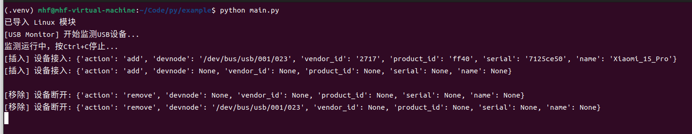

# Python代码合集

<table><tr><td bgcolor=#FFFF00>在这个仓库中收录了一些使用python开发的一些工具、封装的模块和常用功能使用示例。</td></tr></table>

[toc]

## 1  模块（module）

### 1.1  USBMonitor

> USB热插拔监测功能；
>
> 支持windows、linux；
>
> Windows系统USB设备热插拔监测
> 功能特性：
>
> - 基于**WMI**实现设备热插拔事件监听
> - 支持设备插入/移除的双向回调机制
> - 使用独立监控线程避免阻塞主程序
> - 自动处理COM库线程初始化问题
>
> Linux系统USB设备热插拔监测
> 功能特性：
>
> - 基于**pyudev**库监听内核级设备事件
> - 支持USB设备插入/移除事件回调
> - 自动过滤非USB设备事件
> - 使用独立监控线程避免阻塞主程序
> - 支持设备详细信息获取（厂商ID、产品ID等）

**windows演示：**

**linux演示：**

